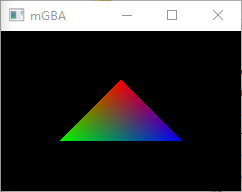

# GBA_helloworld

A basic GBA app

# config devkitPro
- Just follow https://devkitpro.org/wiki/Getting_Started
- (windows only) run devkitPro msys2

# Referencs
- https://gbadev.net/tonc/foreword.html
- [mgba](https://mgba.io/)
- https://github.com/mgba-emu/mgba
